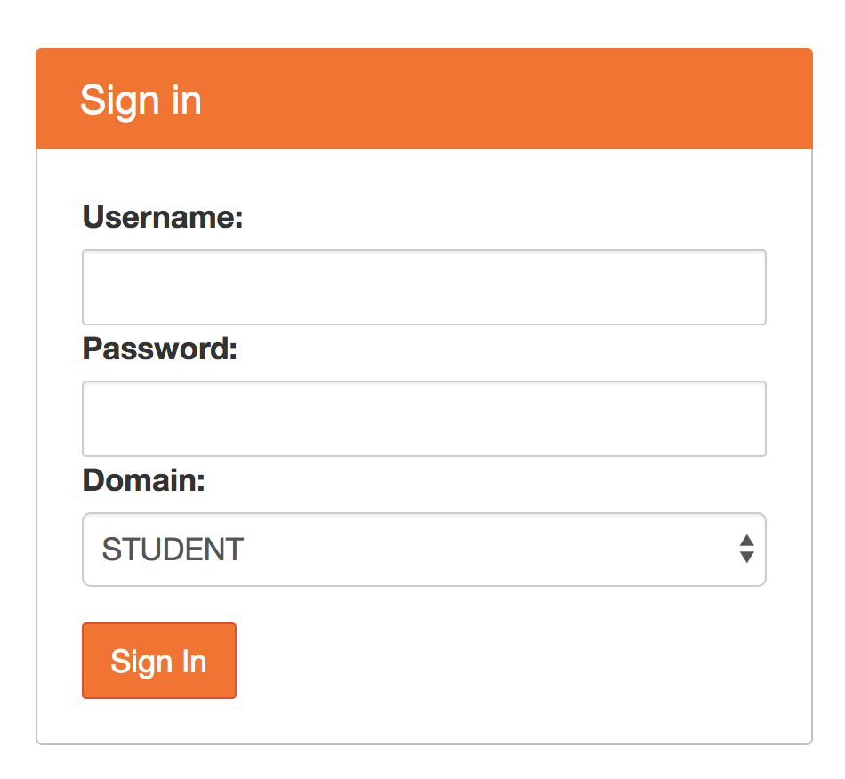
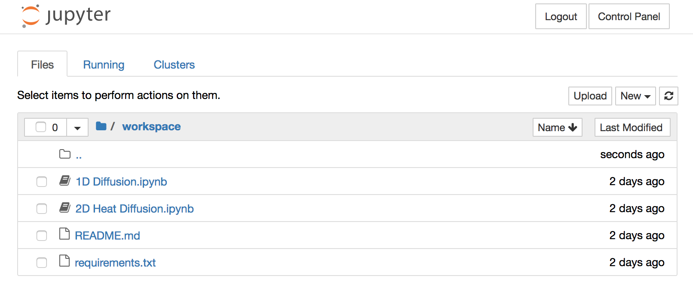
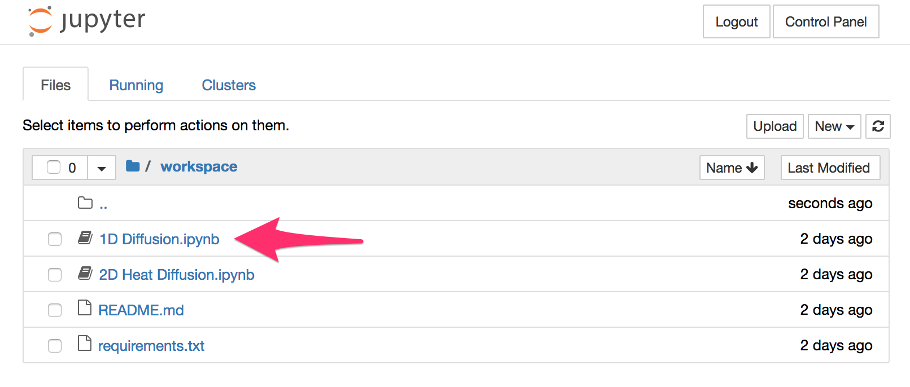
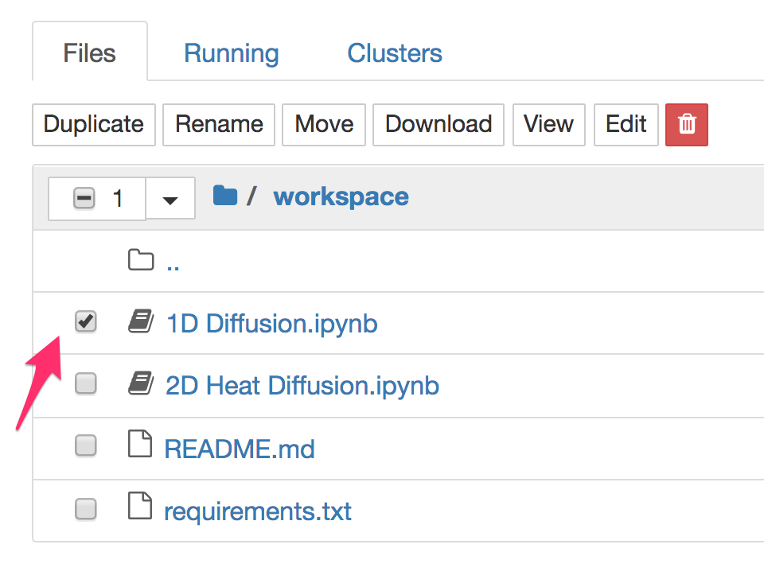

# Guide for JupyterHub Users

JupyterHub is a multi user system for providing a user access to their own Jupyter notebook instance.

A Jupyter notebook provides a means for you to create and share documents that contain live code, equations, visualisations and narrative text. Uses include: data cleaning and transformation, numerical simulation, statistical modelling, data visualisation, machine learning, and much more.


The Jupyter notebooks in the environment you will be using are being used to provide material for you to learn about topics being taught in the course you are enrolled.

If you want to learn more about Jupyter notebooks and how they can be used, you can check out the [Jupyter Project](http://jupyter.org/) web site.

## Logging into JupyterHub

To access the JupyterHub environment, use the URL you have been provided, or access it from the information page for your course on the university portal. You will be presented with the following login page.



Enter your username and password, and select the appropriate domain of ``STUDENT``, ``STAFF`` or ``ASSOC``.

You will only be permitted access to the environment if you are enrolled in the course or have been granted access.

## Jupyter Notebook Instance

Once you have successfully logged in, a Jupyter notebook instance will be automatically started for you, with content for the course.



Depending on the number of users using the environment at the same time, the Jupyter notebook instance may not be deployed immediately. In this case you will see a progress page which tracks the process of starting your Jupyter notebook instance.


## Opening a Jupyter Notebook File

The web interface for the Jupyter notebook instance will display a file browser from which you can view the files for the course. These are located in a ``workspace`` sub folder of your Jupyter notebook instance.

For each different section of material for the course, a separate Jupyter notebook file is provided. The Jupyter notebook files are those with a ``.ipynb`` extension.

To open a specific Jupyter notebook file, click on the name of the file. This is a link which will result in the notebook file being opened in a separate browser window or tab.



The web interface for a Jupyter notebook file will display the code which makes up the notebook, as well as controls which allow you to run, or make changes to the notebook file. You should restrict yourself to running the code cells. Only make changes if you have been instructed to do so, as any changes you make are saved and may affect the operation of the notebook.


To run each successive code cell in the notebook, click on the ``Run`` button.


You can re-run a cell at any time by clicking on the cell and then on ``Run``.

Note that the order in which cells are run is usually important. You should always run cells starting at the beginning of the notebook. This ensures that any require code modules are imported and configured correctly.

If you want to run all code cells in the notebook, you can click on ``Cell`` in the menu bar above the ``Run`` button and select ``Run All``.

## Stopping the Jupyer Notebook Instance

If you have finished using the Jupyter notebook instance, you can shut it down using the JupyterHub control panel. It is requested you do this if possible as it will free up resources in the JupyterHub environment for other users. If you do not shut it down and close the browser window or tab, the Jupyter notebook instance will be automatically shutdown after a period of inactivity.

When the Jupyter notebook instance is shutdown, if you have made changes to the notebook and save them, your changes will still be present the next time you login into JupyterHub, or startup a new Jupyter notebook instance.

To access the JupyterHub control panel, click on the ``Control Panel`` button.


If your Jupyter notebook instance is currently running, the control panel will display the buttons ``Stop My Server`` and ``My Server``.


To stop your Jupyter notebook instance, click on ``Stop My Server``. If you didn't want to stop your Jupyter notebook instance, you can click on ``My Server`` to return to the Jupyter notebook instance.

## Starting the Jupyter Notebook Instance

When you login to the JupyterHub environment a Jupyter notebook instance will be automatically created for you. If you were already logged in and were on the JupyterHub control panel, if your Jupyter notebook instance had been stopped, you will see the ``Start My Server`` button.


Click on the ``Start My Server`` button to startup your Jupyter notebook instance and return to it.

## Failure to Start the Jupyter Notebook

If an error occurs when you attempt to start the Jupyter notebook instance, an error message will be displayed. An error may also be displayed if you were working with a Jupyter notebook and it was shutdown by an adminstrator.

In the event of getting an error message, if you can see the ``Home`` button, click on it to return to the control panel and then click on ``My Server`` or ``Start My Server`` to access or attempt to start up the Jupyter notebook instance.


## Restoring the Original Files

When you login to the JupyterHub environment the first time, you will be given a copy of the course files. These will be kept in persistent storage so that if you make changes they will be there each time you login again and access your Jupyter notebook instance.

If you accidentally make changes to a Jupyter notebook so that it no longer runs correctly, or wish to revert back to the original file you need to perform the following steps.

First select the notebook file you wish to revert back to the original, by clicking on the check box to the left of the filename.



This will reveal buttons for operations that you can perform on the notebook file. Select ``Rename``. This will result in a popup where you can change the name of the notebook file. In renaming the notebook file, if you still want to be able to open it again later, preserve the ``.ipynb`` extension.


Click on ``Rename`` in the popup window and the name will be changed to the new name which you entered.

To have the original file returned, you should now click on ``Control Panel`` and use the ``Stop My Server`` button to shutdown the Jupyter notebook instance. Once stopped, click on ``Start My Server`` to start it again. When the Jupyter notebook instance is started again, the original file will have been restored and your renamed file will still be present.

## New Files for the Course

Your lecturer may provide updates to the files for the course. These may come as updates to the original files, or the addition of extra files.

If extra files are provided and the original files are untouched, you should use the ``Control Panel`` to stop and start your Jupyter notebook instance. The additional files will be added to your workspace.

If an original file was modified, you will need to rename your copy of the file to a different name first, and then stop and start your Jupyter notebook instance.

If many files were changed, you can throw away your complete workspace and start over. To do this, traverse back to the home directory of your Jupyter notebook instance by clicking on the home folder icon.


Click on the checkbox to the left of the ``workspace`` directory and click on ``Rename``. Change the name of the ``workspace`` directory to a different name.

Once the workspace directory is renamed, you should immediately go to the ``Control Panel`` to stop and start your Jupyter notebook instance. When it starts up again, you should have a fresh copy of the ``workspace`` directory. The original workspace directory you renamed should also be present so that you can if necessary access files in that directory.

## Stopping a Running Notebook File

When you open a Jupyter notebook file, this will start a new process in which any code from the notebook file will be run. This will occur for each notebook file you open.

For your Jupyter notebook instance, you are only provided a set amount of memory resources. If you open many notebook files at the same time, you may use up all your memory resource quota and notebooks may not start or may not run correctly.

In this situation you will need to completely close down any open notebook files you have running and do not need, or potentially restart the complete Jupyter notebook instance.

To completely close down an open notebook file, first close the browser tab or window for that Jupyter notebook file. Then from the file browser, select the ``Running`` notebooks tab.


Find entries for running notebooks that you no longer need, and click on the ``Shutdown`` button against that entry.


If you have any running ``Terminal`` sessions which you do not need, these also can be shutdown to reclaim memory resources.

## Accessing the Control Panel

The control panel can be accessed from the Jupyter notebook instance, or open Jupyter notebook file by clicking on the ``Control Panel`` file. If you are viewing a page which is part of JupyterHub and do not see the ``Control Panel`` button, but can see a ``Home`` button use it instead.

If your page is showing an error and there is no obvious way to get back to the ``Control Panel``, adjust the URL in your browser to use ``/hub/home``:

```
https://jupyterhub-coursename.pods.ntu.edu.sg/hub/home
```

If you have deleted any directory from your Jupyter notebook instance, but the browser is still trying to access the deleted directory and gives an error, you can return back to the home directory of your Jupyter notebook instance by changing the URL to ``/user/yourusername/tree``:

```
https://jupyterhub-coursename.pods.ntu.edu.sg/user/yourusername/tree
```

The ``coursename`` and ``yourusername`` should be replaced with the appropriate name for the course and your login username.
